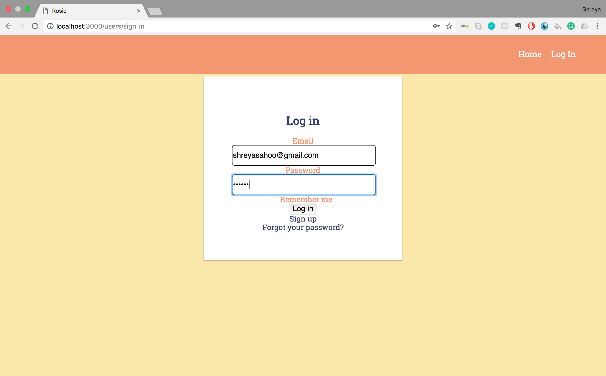
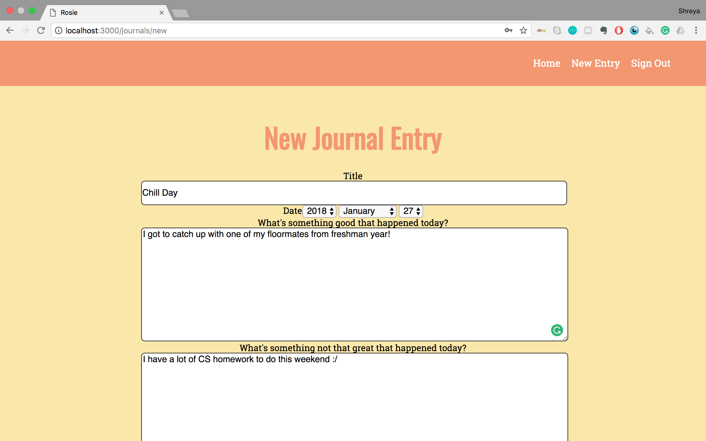
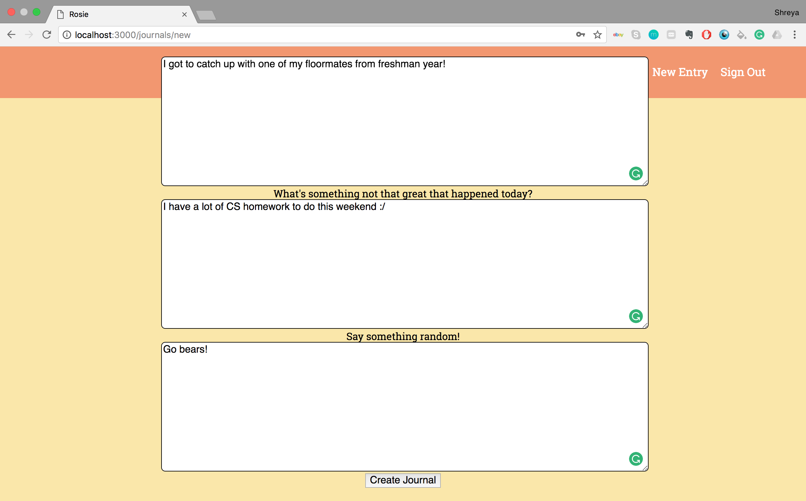

Rosie was inspired by an article I read recently about the positive effects of journaling. (http://www.huffingtonpost.ca/2017/06/20/benefits-of-journaling_n_17212154.html)

I wnted to create a journal-like application that allows users to write about their day.

I started out this application by creating a simple design on Figma. I wanted to use bright colors, so I chose the color scheme of shades of yellow, orange, and blue. I watched and read several tutorials about the basics of Rails, MVC,  and various gems when I was creating Rosie.

This is the home page.

This is the log-in page.

This is the sign-in page.

When users are logged in and have not made an entry yet, they will see this page.

By clicking new journal or new journal entry, users are brought to this page where they can answer the questions below to create a new entry.

The new entry will be featured on the home page. 

To read the entry, click on the entry on the home page. 

Users can also edit and delete entries. 

After an entrie is deleted, it is removed from the home page.
